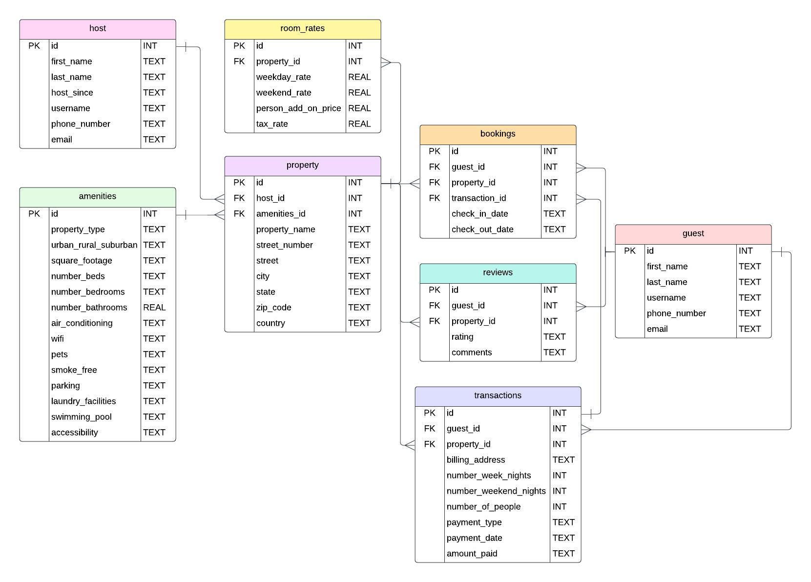

# AirBnB Database Design

# Design Document

By Yodd Mena
and Mauricio Gutierrez

Video overview: <https://youtu.be/xiEOWiWo_dU>

## Scope

* The purpose of the database is to manage an AirBnB booking system efficiently by tracking guest information, host details, property amenities, and transaction records. It records bookings, ensuring no double bookings by tracking check-in and check-out dates for each property. By providing real-time availability for properties and enabling users to query for open dates, the database helps streamline AirBnB operations, manage reservations, and optimize the guest experience. It also facilitates smooth financial transactions and maintains review data to improve property offerings.

The scope of the database includes several key entities:

People:
* Guests: Individuals who book properties.
* Hosts: Property owners or managers who list properties for booking.

Places:
* Properties: Various types of accommodations, such as apartments, houses, condos, villas, etc., located in different cities, states, and countries.
    * Property locations: Address details including street, city, state, and country to facilitate bookings and searches based on geographic location.

Things:
* Amenities: Features available at properties, such as WiFi, air conditioning, parking, swimming pools, and accessibility options.
Bookings: Reservations made by guests, including check-in and check-out dates.
* Transactions: Financial records associated with bookings, detailing payment methods, amounts, and billing information.
Reviews: Guest feedback and ratings for properties they have stayed at.

The scope of the database is focused on managing the key elements related to property rentals, such as property listings, guests, hosts, transactions, reviews, and bookings. It does not include external factors like weather conditions or local crime rates. While these elements may influence a guest's decision to book a property, they are not directly tracked or managed within the system. The database is specifically designed to handle internal operations and interactions within the rental ecosystem, leaving broader environmental or safety metrics outside its scope.

## Functional Requirements

With the database, a user should be able to:
* View Property Listings: Access details about available properties, including their names, locations, and amenities.
* Check Property Availability: Determine which properties are available for booking on specific dates by querying against existing bookings.
* Make Bookings: Create new bookings, specifying check-in and check-out dates, and associate them with the guest and property.
* Track Transactions: View transaction records to see payment details related to bookings, including amounts paid, payment types, and billing addresses.
* Review Properties: Submit and view reviews for properties, including ratings and comments from guests.
* Manage Guest and Host Information: Access and update information about guests and hosts, including contact details and user IDs.
* Monitor Booking Conflicts: Identify and prevent double bookings by ensuring that no overlapping reservations are made for the same property.

A user can extend the use of the database by
* accessing which listings are most frequently booked , allowing them to identify trends or popular listings.
* calculating the average ratings of a host’s listings, providing insight into overall customer satisfaction with their property.
* tracking the performance of hosts by comparing the number of bookings, ratings, and earnings across different listings.
* comparing multiple listings based on various criteria such as price, rating, and amenities, to evaluate which properties offer the best value or experience.
* filtering a desired price range for listings, dates, bedrooms, beds, bathrooms and amenities.

## Representation

### Entities

#### Guest

The `guest` table includes:

* `id`, which stores the unique ID for the guest as an `INTEGER` and therefore has the `PRIMARY KEY` constraint applied.
* `first_name`, which is the first name of the guest as `TEXT`, since `TEXT` is appropriate for name fields.
* `last_name`, which is the first name of the guest as `TEXT`, since `TEXT` is appropriate for name fields.
* `username`, which stores the username of the guest’s account as `TEXT` is used for the same reason as `first_name`. A `UNIQUE` constraint prevents two account holders from having the same username for the Air BnB application/website.
* `phone_number`, which specifies the guest’s phone number as `TEXT``TEXT` is used since we will not be performing any type of arithmetics and therefore do not need it to be numeric. Also, it provides flexibility for handling different phone number formats. A `UNIQUE` constraint prevents two account holders from having the same phone number.
* `email`, which stores the guest’s email address as `TEXT`, given `TEXT` which is appropriate for our use-case scenario which may include letters, symbols and numbers. A `UNIQUE` constraint ensures that no two customers have the same email tied to their account.

All the columns in this table contain the `NOT NULL` constraint, since each guest is required to sign up for an AirBnB account in order to complete and pay for their booking(s).

#### Host
The `host` table includes:

* `id`, which specifies the unique ID for the student as an `INTEGER`. This column thus has the `PRIMARY KEY` constraint applied.
* `first_name`, which stores the host's first name as `TEXT`, since `TEXT` is appropriate for name fields.
* `last_name`, which stores the host's last name as `TEXT`, since `TEXT` is appropriate for name fields.
* `host_since`, which records the year the host began hosting through AirBnB. `TEXT` is used since we will not need to perform date specific operations or arithmetic operations. Therefore we do not need it to be numeric nor a date since data records the month, day, and year.
* `username`, which stores the host's AirBnB username. `TEXT` is used for the same reason as `first_name`. A `UNIQUE` constraint ensures no two hosts have the same AirBnB username.
* `phone_number`, which stores the host’s phone number. `TEXT` is used since we will not be performing any type of arithmetics and therefore do not need it to be numeric. Also, it provides flexibility for handling different phone number formats.
* `email`, which stores the host’s email address associated with their AirBnB account. `TEXT` is used for the same reason as `first_name`. A `UNIQUE` constraint ensures that no two hosts have the same email address associated with their AirBnB account.

All columns are required and hence have the `NOT NULL` constraint applied where a `PRIMARY KEY` constraint is not.

#### Amenities
The `amenities` table includes:

* `id`, which stores the unique ID for the amenities as an `INTEGER`. This column thus has the `PRIMARY KEY` constraint applied.
* `property_type`, which specifies the property type such as apartment, house, barnhouse, etc). This column is set to the type affinity `TEXT` since we are storing strings.
* `urban_rural_suburban`, which specifies the area the property is located i.e. urban, rural or suburban as the column name suggests. This column is set to the type affinity `TEXT` since we are storing strings.
* `square_footage`, which specifies the square footage of the property in square feet and its type will be ‘TEXT’ since no arithmetic operation will be performed.
* `number_beds`, which specifies the number of beds provided in the property by the host as`INTEGER`.
* `number_bedrooms`, which specifies the number of bedrooms provided in the property by the host as`INTEGER.
* `number_bathrooms`, which specifies the number of bathrooms provided in the property by the host as `REAL` since bathrooms can be counted as “half a bathroom” and therefore need it to store decimal values as well .
* `air_conditioning`, which states whether the property has an AC unit for use and will be denoted as ‘Yes’ or ‘No’. This column is set to the type affinity `TEXT` since we are storing strings.
* `wi-fi`, which states if the property will provide the customer with a wi-fi connection during their stay or not and will be denoted as ‘Yes’ or ‘No’. This column is set to the type affinity `TEXT` since we are storing strings.
* `pets`, which states whether or not pets are allowed in the property during their stay and will be denoted as ‘Yes’ or ‘No’. This column is set to the type affinity `TEXT` since we are storing strings.
* `smoke_free`, which states whether or not smoking is allowed during their stay at the property and will be denoted as ‘Yes’ or ‘No’. This column is set to the type affinity `TEXT` since we are storing strings.
* `parking`, which states whether the customer can park on the property, parking garage, or street and will be denoted as ‘Yes’ or ‘No’. This column is set to the type affinity `TEXT` since we are storing strings.
* `laundry_facilities`, which states if the customer will be provided with laundry facilities on the property such as a washer and dryer and will be denoted as ‘Yes’ or ‘No’. This column is set to the type affinity `TEXT` since we are storing strings.
* `swimming_pool`, which states whether the property has a pool or not and will be denoted as ‘Yes’ or ‘No’. This column is set to the type affinity `TEXT` since we are storing strings.
* `accessibility`, which indicates nearby points of interests, such as popular attractions and places to visit surrounding in the area or city.This column is set to the type affinity `TEXT` since we are storing strings.

All the columns in this table contain the `NOT NULL` constraint, since each transaction should have a relationship to the customer and listing and should contain details from the transaction. Also the columns that have “yes” or “no” as an input will have the CHECK constraint.

#### Property
The `property` table includes:

* `id`, which stores the unique ID for the property as an `INTEGER`. This column thus has the `PRIMARY KEY` constraint applied.
* `host_id` which is the ID of the host that posted the listing as an `INTEGER`. This column thus has the `FOREIGN KEY` constraint applied, referencing the `id` column in the `host` table to ensure data integrity.
* `amenities_id` which is the ID of the amenities that are associated with that property as an `INTEGER`. This column thus has the `FOREIGN KEY` constraint applied, referencing the `id` column in the `amenities` table to ensure data integrity.
* `property_name` which stores the name of the property as `TEXT`, since it is also a name.
* `street_number`, which stores the street number of the property as `TEXT` since no arithmetic operations will be performed.
* `street`, which stores the street name of the property as `TEXT` since it is the name of the street and therefore stored as a string.
* `city`, which specifies the city of the property as `TEXT` for the same reason as `street`.
* `state`, which specifies the state that the property is located as `TEXT` for the same reason as `street`.
* `zip_code`, which specifies the zip code that the property is located as `TEXT`, since there will not be any type of arithmetic operations performed.
* `country`, which specifies the country of the property as `TEXT`, for the same reason as `street`.

All the columns in this table contain the `NOT NULL` constraint, since each property must have an accurate listing to where the property is located and what type of amenities are included with that listing.

#### Room Rates
The `room_rates` table includes:

* `id`, which specifies the unique ID for the transaction as an `INTEGER` and therefore has the `PRIMARY KEY` constraint applied.
* `property_id`, which is the ID of the property that is paired with this transaction as an `INTEGER`. This column thus has the `FOREIGN KEY` constraint applied, referencing the `id` column in the `property` table to ensure data integrity.
* `weekday_rate`, which is the going rate for a property during a weeknight, stored as a `REAL` number.
* `weekend_rate`, which is the going rate for a property during a weekend night, stored as a `REAL` number.
* `person_add_on_price`, is the price to add extra guests onto the booking stores as a `REAL` number. Note that some properties have the max number of guests built into the rate, meaning that it’s 0 dollars for the add on price, while other properties have this as a separate cost.
* `tax_rate`, is the tax rate of the state for goods and commodities stored as a `REAL` number. There are some stages that do not have statewide sales tax, therefore those properties will have a tax rate of 0%.

All the columns in this table contain the `NOT NULL` constraint, since each property should have pricing details available in order for customers to complete their transactions.

#### Transactions
The `transactions` table includes:

* `id`, which specifies the unique ID for the transaction as an `INTEGER` and therefore has the `PRIMARY KEY` constraint applied.
* `guest_id`, which is the ID of the guest that completed this transaction as an `INTEGER`. This column thus has the `FOREIGN KEY` constraint applied, referencing the `id` column in the `guest` table to ensure data integrity.
* `property_id`, which is the ID of the property that is paired with this transaction as an `INTEGER`. This column thus has the `FOREIGN KEY` constraint applied, referencing the `id` column in the `property` table to ensure data integrity.
* `billing_address`, which is the customer’s billing address transaction as `TEXT`. This column thus has the `FOREIGN KEY` constraint applied, referencing the `id` column in the `listing` table to ensure data integrity.
* `payment_type`, which contains the type of payment received from the customer, such as ‘debit’ or ‘credit’, ect. This column is set to the type affinity `TEXT` since we are storing strings.
* `payment_date`, which is the date the customer completed the transaction as `DATE`, which is stored as ‘YYYY-MM-DD’.
* `amount_paid`, specifying the amount that was paid by the customer as a `REAL`, appropriate for this circumstance since we are able to gather statistics on this column.

All the columns in this table contain the `NOT NULL` constraint, since each transaction should have a relationship to the guest and property and should contain details from the transaction.

For the columns `number_week_nights`, `number_weekend_nights`, `number_of_people`, `amount_paid` are all defaulted to 0. Since 0 is considered as null, it will fail the NOT NULL constraint, we used DEFAULT 0. It is possible that some guest will have 0 week nights and 0 weekend nights. This also allows the `amount_paid` to be calculated from the `room_rates` table using the UPDATE command.

#### Reviews
The `reviews` table includes:

* `id`, which specifies the unique ID for the review as an `INTEGER`. This column thus has the `PRIMARY KEY` constraint applied.
* `guest_id`, which is the ID of the guest that completed this transaction as an `INTEGER`. This column thus has the `FOREIGN KEY` constraint applied, referencing the `id` column in the `guest` table to ensure data integrity.
* `property_id`, which is the ID of the property as an `INTEGER`. This column thus has the `FOREIGN KEY` constraint applied, referencing the `id` column in the `property` table to ensure data integrity.
* `rating` which is the rating from 1 (worst) to 5 (best) the customer gives based on their experience with the listing and host. This is stored as an `INTEGER`.
* `comments` specifying the comments that customers add to the review if any. We are allowing this column to be `NULL` since customers are not required to add comments to their review.

All columns except for `comments` contain the `NOT NULL` constraint, since each review that is submitted should have a rating in relation to the customer and the listing.

#### Bookings
The `bookings` table includes:

* `id`, which specifies the unique ID for each booking stored as an `INTEGER`. This column thus has the `PRIMARY KEY` constraint applied.
* `guest_id`, which is the ID of the guest stored as an `INTEGER`. This column thus has the `FOREIGN KEY` constraint applied, referencing the `id` column in the `guest` table to ensure data integrity.
* `property_id`, which is the ID of the property that the host is hosting stored as an `INTEGER`. This column thus has the `FOREIGN KEY` constraint applied, referencing the `id` column in the `property` table to ensure data integrity.
* `transaction_id`, which is the ID of the transaction made when booking a stay in the property and it’s stored as an `INTEGER`. This column thus has the `FOREIGN KEY` constraint applied, referencing the `id` column in the `transactions` table to ensure data integrity.
* `check_in_date`, which is stored as `DATE` so the user is able to perform date-specific operations.
* `check_out_date`, which is stored as `DATE` for the same reason as `check_in_date`.

### Relationships

## Optimizations

#### Views
The `all_bookings` view provides a comprehensive overview of property bookings by combining data from the `property` and `bookings` tables. This view is designed to deliver a clear and consolidated view of all bookings across properties. It includes the following columns:
* `id`: The unique identifier for the property, sourced from the `property` table.
* `property_name`: The name of the property, as recorded in the `property` table.
* `check_in_date`: The date on which a guest checks into the property, sourced from the `bookings` table.
* `check_out_date`: The date on which a guest checks out of the property, sourced from the `bookings` table.

The view achieves this by joining the `property` table with the `bookings` table on the `property_id` field. This allows users to see all bookings for each property along with relevant details about the property itself. It is useful for analyzing booking patterns, checking availability, and managing property reservations.

#### Triggers
Additionally, a trigger was added to the design. This trigger, `prevent_double_booking`, ensures that no two bookings for the same property overlap in time. It runs before any new booking is inserted into the bookings table. It's purpose is to checks if there is any overlap between the new booking (`NEW.check_in_date` and `NEW.check_out_date`) and existing `bookings` in the bookings table for the same property (`property_id`).

The EXISTS clause checks if any booking already exists for the same property (NEW.property_id) where:
* The new booking's check-in date falls between an existing booking’s check-in and check-out dates.
* The new booking's check-out date falls between an existing booking’s check-in and check-out dates.
* An existing booking’s check-in date falls within the new booking's check-in and check-out dates.

The three conditions ensure that no booking overlaps in any way—whether it starts or ends within the dates of an existing booking or entirely encompasses another booking's duration. If any of the conditions are true (meaning there’s an overlap), the trigger raises an error: 'Booking overlaps with an existing booking'. This `RAISE(ABORT)` command stops the insert operation and returns the specified error message to prevent the double booking.

#### Indexes
Creating an index for host name search:

* This creates an index called `host_name_search` on the `host` table, specifically on the `first_name` and `last_name` columns.
It allows the database to quickly search or query hosts by their first and last names, improving performance when those columns are involved in search conditions.

Creating an index for guest name search:

* Similarly, this creates an index called `guest_name_search` on the `guest` table, targeting the `first_name` and `last_name` columns. This speeds up queries where guests are searched by their first and last names.

Creating an index for property location search:

* This creates an index called `city_name_search` on the `property` table, focusing on the `city` and `state` columns. It improves search efficiency when properties are being queried based on their city and state, making location-based queries faster.

## Limitations

Some of the limitations of our design include:
* The database is not designed to integrate directly with external platforms, such as other online booking systems that will notify AirBnb about any bookings done on the same listings from an external or third party app.
* As the amount of data grows, particularly with large numbers of bookings, customers, and listings, the performance of the database may degrade without proper optimization or scaling strategies.
* The design does not include comprehensive user authentication or access control mechanisms, potentially limiting its use in environments where data security is critical such as the customer’s transactions history.
* This database is only for the purpose of managing and storing data based on the bookings in AirBnB and does not communicate directly with other factors such as housekeeping i.e. scheduling housekeeping.

Things the database might not represent well:
* The database might not handle complex relationships between entities very well, such as overlapping ownership, properties managed by multiple hosts, or customers who book multiple listings simultaneously.
* If the prices change frequently based on demand, seasonality, or other factors, the database may not be well-suited to track these fluctuations or apply dynamic pricing strategies without additional complexity.
* Since the database allows for comments on the ‘reviews’ table such as detailed review and feedback, then the database might struggle with efficiently storing, indexing, and retrieving this unstructured data.

